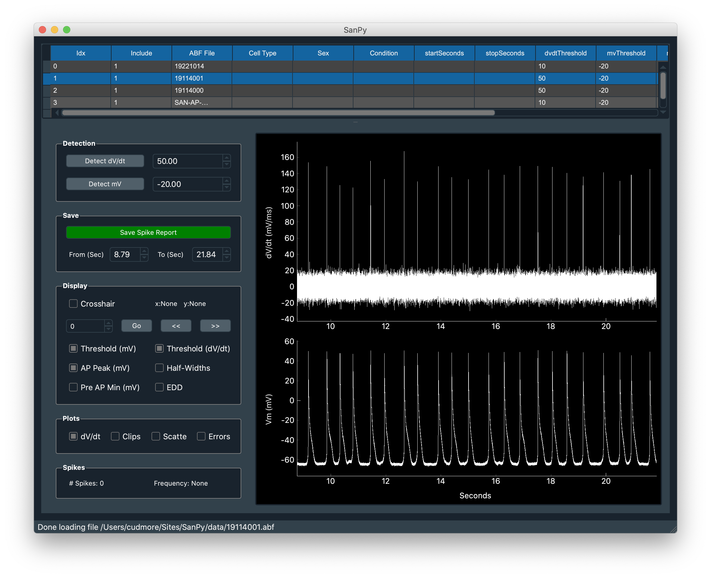

The desktop application allows the user to load a folder of files (top table). Selecting a file will display both the derivative and raw membrane potential (middle two traces). Spike detection is then easily performed by specifying a threshold in either the derivative of the membrane potential or the membrane potential itself. Once spikes are detected, the detection parameters are overlaid over the raw membrane and derivative traces. Finally, there is an interface (lower table and colored plot) to inspect the detection parameters.

broken

works?

works 2?

<!--  -->
