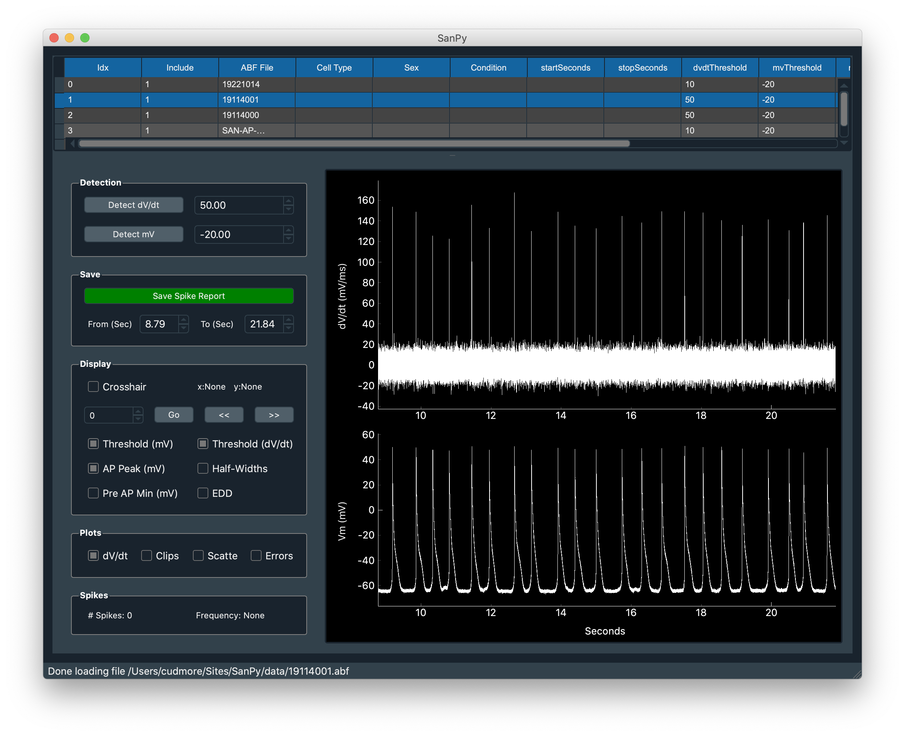
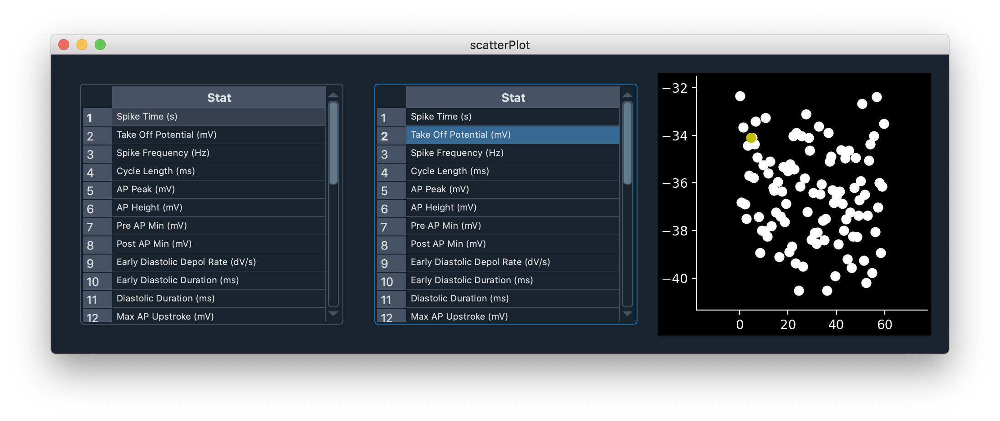
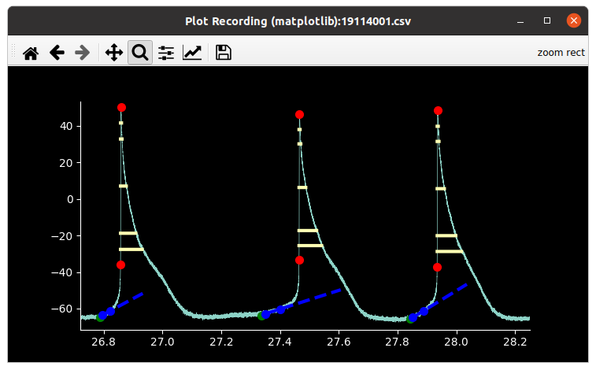
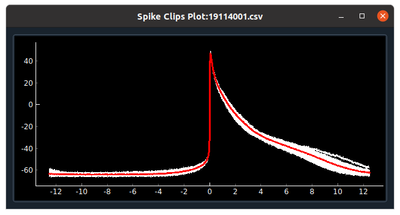
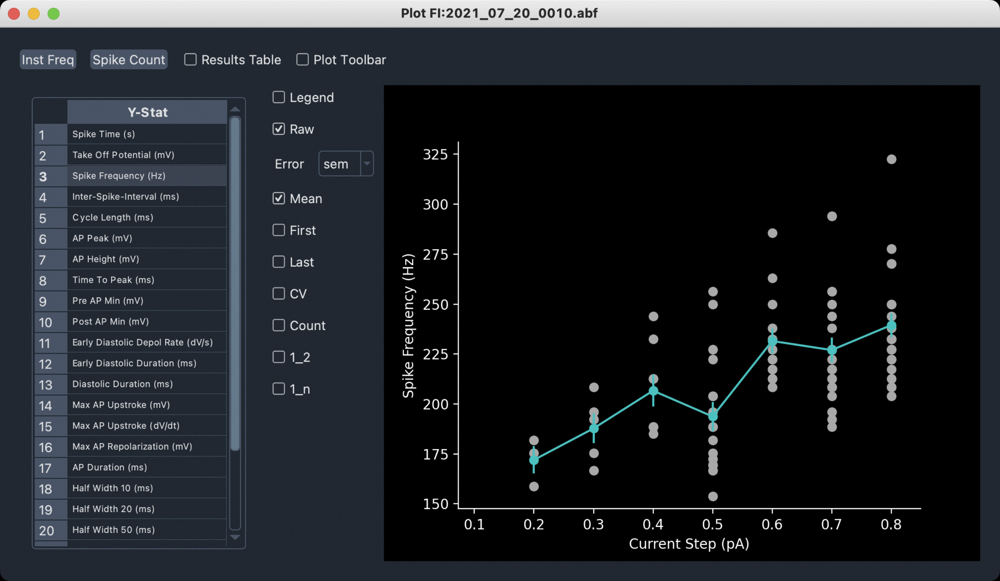
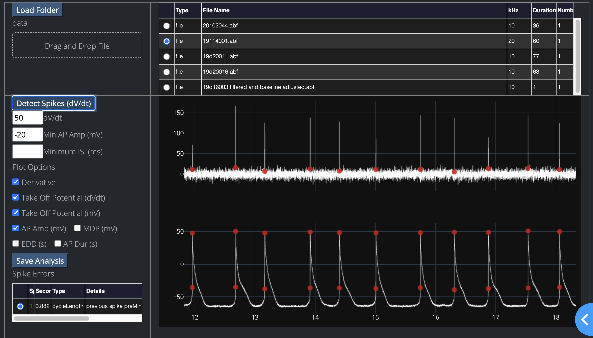

SanPy is software to perform analysis of whole-cell curent clamp recordings. It is designed to work on a range of excitable cells including cardiac myocytes and neurons. Historically, it was originally designed for spontaneous [cardiac action potentials][cardiac action potential] from [whole-cell current-clamp][patch-clamp] recordings of [cardiac myocytes].

If you find the code in this repository interesting, please email Robert Cudmore at UC Davis (rhcudmore@ucdavis.edu) and we can get you started. We are looking for users and collaborators.

## Key features:

1) Easy to use [desktop application](desktop-application) with a growing number of built in [plugins](plugins).

2) An [API](api/overview) for full control of all aspects of file loading and analysis.

3) SanPy has a [plugin](api/writing-a-plugin.md) architecture and provides a wide range of pre-built plugins. We invite the community to build their own.

4) SanPy has a [file loader](api/writing-a-file-loader.md) architecture so any type of raw data can be opened. We provide file loaders for Molecular Devices (Axon Instruments) abf and atf file formats (using pyAbf), as well as general purpose comma-seperated-value files (csv).

5) SanPY implements a rich range of [analysis results](methods/#analysis-results) such as spike threshold detection, interval statistics, and spike shape analysis. Like the plugin and file loading architecures, SanPy also provide a software architecute to add [new analysis](api/writing-new-analysis.md) measurements.

### SanPy preprint on bioRxiv

Guarina L, Johnson TL, Griffith T, Santana LF, Cudmore RH (2023) SanPy: A whole-cell electrophysiology analysis pipeline. bioRxiv 2023.05.06.539660; doi: [https://doi.org/10.1101/2023.05.06.539660](https://doi.org/10.1101/2023.05.06.539660)]

## [Desktop Application](desktop-application)

## [Plugins](plugins)

<!--  -->

<table>
<tr>
    <td>
    
    </td>
    <td>
    
    </td>
</tr>
<tr>
    <td>
    
    </td>
    <td>
    
    </td>
</tr>
</table>

<!-- ### On the web -->

<!--  -->

<!--
## For anyone interested

SanPy is pronounced ['senpai']['senpai']
-->

[cardiac action potential]: https://en.wikipedia.org/wiki/Cardiac_action_potential
[cardiac myocytes]: https://en.wikipedia.org/wiki/Cardiac_muscle_cell
[patch-clamp]: https://en.wikipedia.org/wiki/Patch_clamp

['senpai']: https://en.wikipedia.org/wiki/Senpai_and_k%C5%8Dhai
