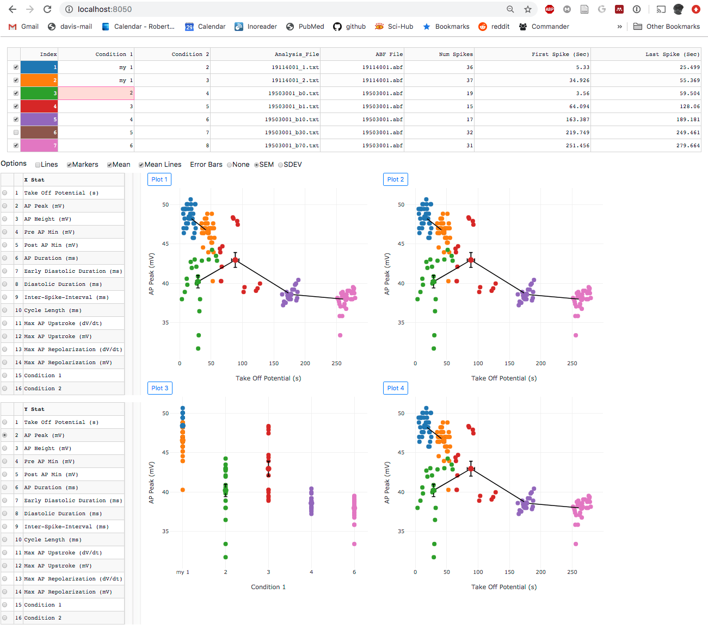

The browser based web application provides the same interface for analysis as the desktop application.


Once data is analyzed, Pooling allows browsing detection parameters across any number of files.



### Install the web application

Please note, this is experimental and does not have all functions implemented. Please use the desktop version instead.

```
cd SanPy/dash

python3 -m venv sanpy_dash
source sanpy_dash/bin/activate

pip install -r requirements.txt

# install sanpy from local copy of repository
pip install -e ../.
```

### Running the web applications

Run the web application to analyze raw data

```
cd SanPy/dash
source sanpy_dash/bin/activate
python app2.py
```

The web application for analysis is available at

```
http://localhost:8000
```

Run the web application to browse and pool saved analysis

```
cd SanPy/dash
python bBrowser_app.py
```

The web application for browsing and pooling saved analysis is available at

```
http://localhost:8050
```
