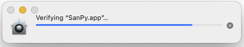
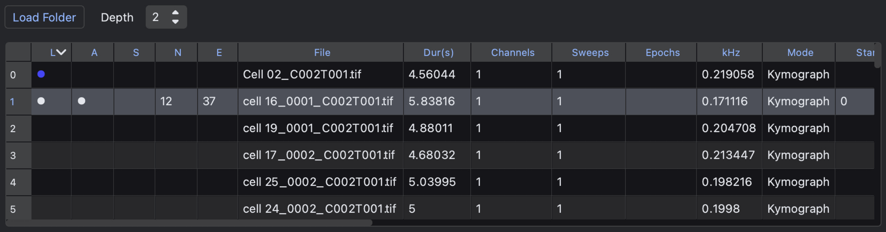
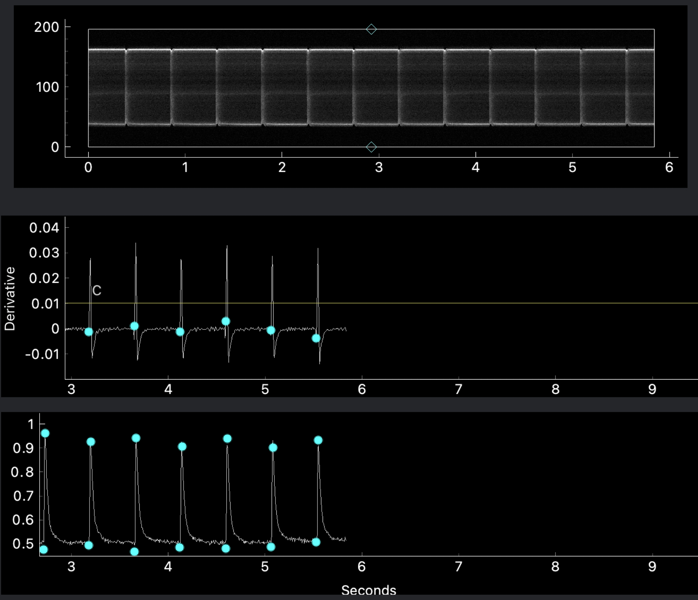
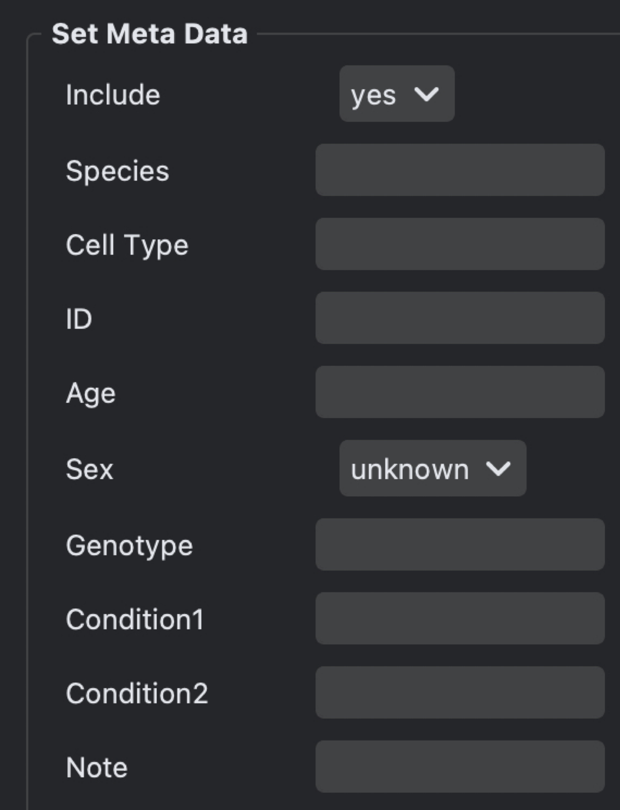
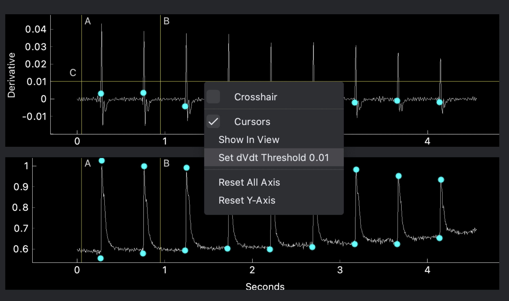
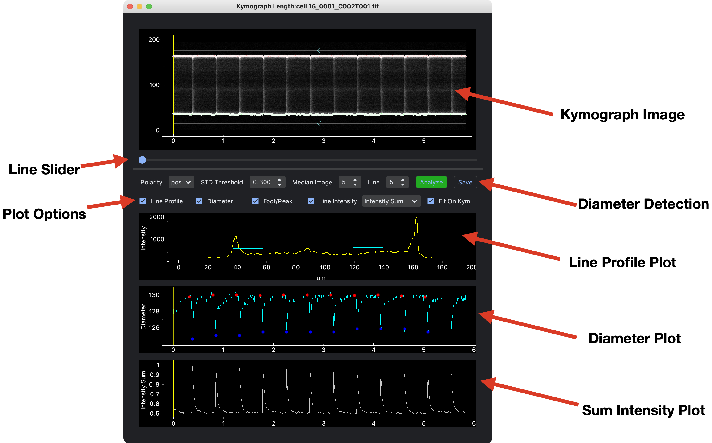
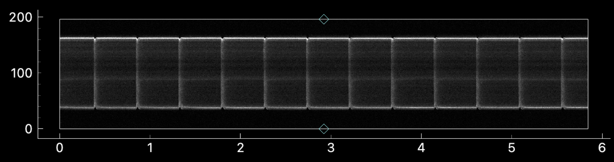
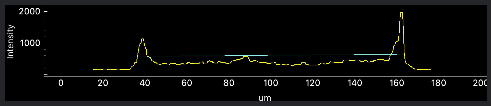
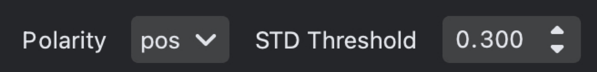
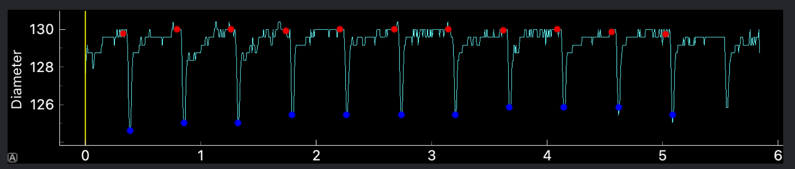

## SanPy Kymograph Workflow

### Introduction

The goal here is to make a desktop GUI that allows mere biologists to perform rather complex analysis. This is the first version (we call it an `alpha` version) and with this, **a lot will not work**. If anything does not work as described or expected, or is plain confusing then let me know and I will fit it ASAP!

### Download, install, and run the SanPy app

 - Download a zip of the macOS app here: SanPy-macOS-x86.zip.
 - Once downloaded, double-click the zip file to extract the macOS app.
 - Double click `SanPy.app` to run the SanPy GUI.

On first run, You will see SanPy has to be verified and the application icon will bounce for awhile before the GUI opens. This is normal and will not happen the next time you run SanPy.

Now, you should see the the main GUI. If you do not see the main GUI, contact Robert and we will fix it ASAP!!!

### Overview of workflow for Kymograph analysis

First we will load a folder of tif file Kymographs. Next, for each tif file, we detect spikes in the sum intensity of each line scan in the kymoograph. Then we use the `Kymograph Length` plugin to estimate the length (e.g. diameter) of each line scan in the kymograph. Finally, all analysis is saved and can be reloaded and reanalyzed.

### Scripting the analysis

One major way this code and workflow differs from commercial software such as pClamp is that we can script it. If you use the GUI to save analysis, we can come back in later to batch analyze and make new analysis and plots as you like. This is super powerful. Lets chat about it.

### 1) Load a folder of files

Once the SanPy GUI is running ...

If your kymographs tif files are in subfolders then specify `Depth 2`.

Click `Load Folder` and select the folder to load. For example:

    /Box/contraction data/Fig 1 data

### File List

Once a folder is loaded, the `File List` will populate with a list of files in the folder(s). Single click on a file at it will be shown with three views

 - Kymograph
 - Derivative
 - Sum Intensity

**Known Bug.** The x-axis of the Kymograph image is offset with respect to the derivative and sum intensity plots. Working on fixing this but is obviously not working :(

### 1.5) Setting meta data for each file.

Open the `Set Meta Data` plugin to set some metadata for each file. For example the `sex` or a text `Note` for the file. Meta data is saved and loaded just like analysis.

 

### 2) Detecting spikes.

We will be detecting spikes by specifying a threshold in the first derivative. This is a very common technique and works well.

 1) The derivative plot will have a horzontal cursor (yellow line). Click and drag the cursor-line to the desired threshold.
 
 2) Press the right-mouse button and select `Set dVdt Threshold`.
 
 3) The threshold value will be filled in the `Detection` panel.
 
 4) In the `Detection` panel click the `Detect dV/dt` button.
 
 5) All analysis in a folder(s) can be saved with the menu `File - Save Folder Analysis` or using keyboard `command s`.

Once spikes are detected, their threshold and peak will be overlaid in the `Sum Intensity` plot (blue circles).

**Advanced.** Inspect the threshold and peak, if something looks off, adjust the threshold by reducing it and proceed with steps 2/3/4 above.

### 3) Kymograph Length plugin

Open the kymograph length plugin using the main menu `Plugins - Kymograph Length`. A new window will open with the plugin.

**Note.** You can leave this window open, as you select new files in the main interface, it will refresh with your file selection.

**Note.** You can also use the main menu `File - Save Preferences` and the plugin will automatically re-open in the same screen position next time you run SanPy.

#### Interface

 - Use the mouse wheel to zoom in and out of the image or the plots.
 - Use the `Line Slider` to visualize individual line scan intensity profiles. Individual line profiles are show in the `Line Profile` plot (yellow line) and the estimated diameter for that line is shown as a horizontal (blue) line. All other plots have a vertical line (yellow) to tell you the current line you are viewing.
 - If the Kymograph image takes up too much space you can click+drag to reduce its size.

#### Diameter Detection Recipe

 1) Drag the top and bottom rectangular ROI (click and drag the cyan triangle) to make sure the ROI does not enclose any bright-spots outside the cell. You can use the mouse wheel to zoom in for more details. You can always return to full view with keyboard `Enter` or right-click the Kymograph image and select `Reset Zoom`.
 
 2) Scroll through line scans with the `Line Slider` and check how the diameter detection is doing. The detected diameter is the horizontal (blue) line in the `Line Profile` plot.

 3) The main parameter you need to play with is the `STD Threshold` which chooses the intensity for diameter detection as the "mean + STD Threshold". Set a value and repeat step 2/3 until it looks reasonable. I have used 0.3 and 0.03 as starting points and this depends on the Kymograph.

 
 

 4) The other parameter to set is the `Polarity` as `positive` or `negative`. Most well behaved Ca++ kymographs will get brighter in the cell and you use the default of `pos`. In some cases, the intensity actually decreases in the cell and you would use `neg`.

 5) Hit the `Analyze` button and you will see the diameter results (one diamter per line scan) in the `Diameter Plot`.

 6) Hit the `Save` button and the diameter analysis will be saved in a text file (csv).

**Important.** The main diameter analysis critically depends on your chour of (i) the rectangular ROI and (ii) the STD Threshold. Please get in touch with me for my strategies and best practices. In particular, if your diameters routinely look like garbage, I can help (beyond the scope of this recipe)!!!

## Troubleshooting

If you `Load Folder` and no files appear. Contact Robert

