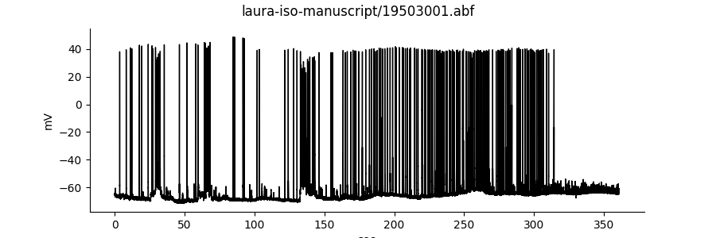
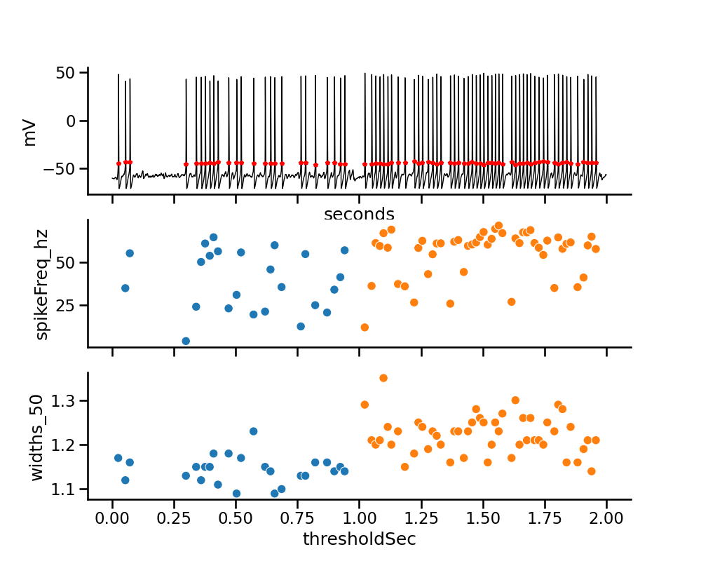
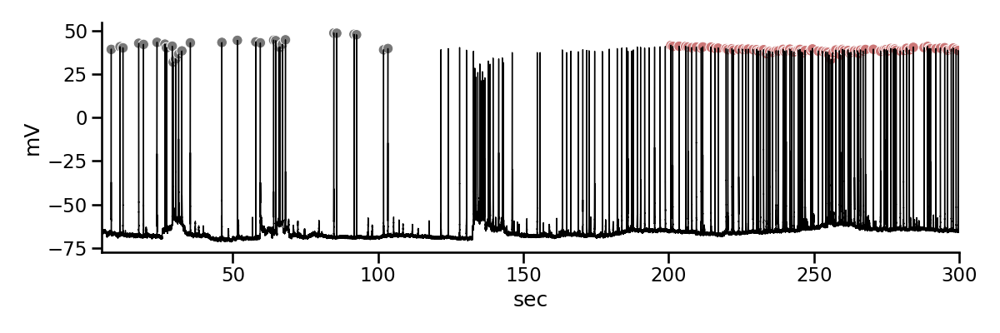
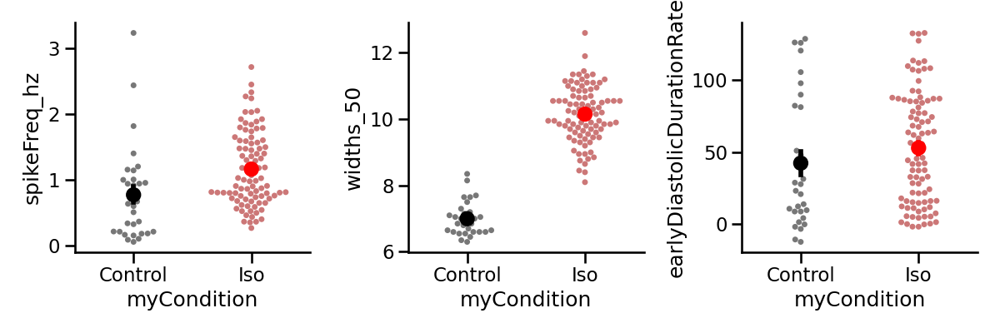

This folder contains Python code and raw data files to regenerate the figures from the manuscript

### figure_3.py will generate the following plots

### Figure_4_api.py will generate the following

### Figure_5_timing.py will generate Figure 5 in the manuscript.

Contact the authors to get the raw data.

### figure_6_myocyte_analysis.py will generate the following

