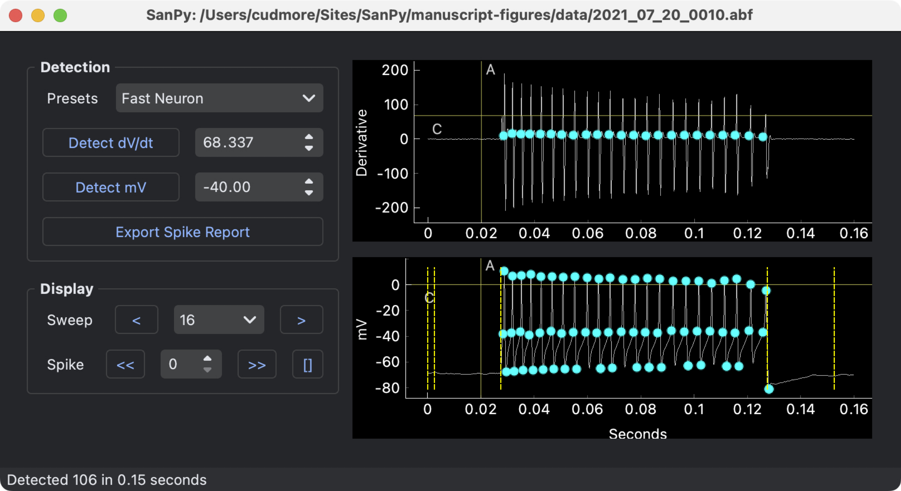
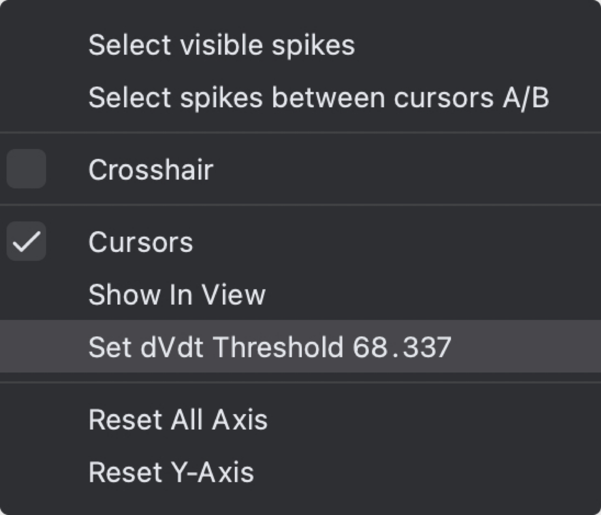
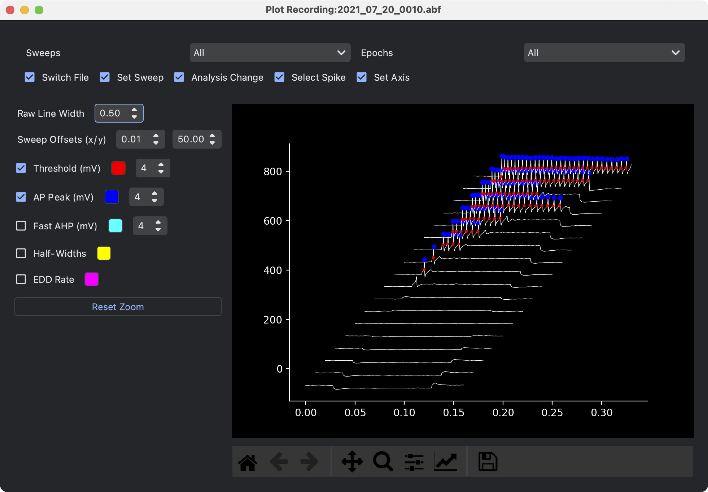
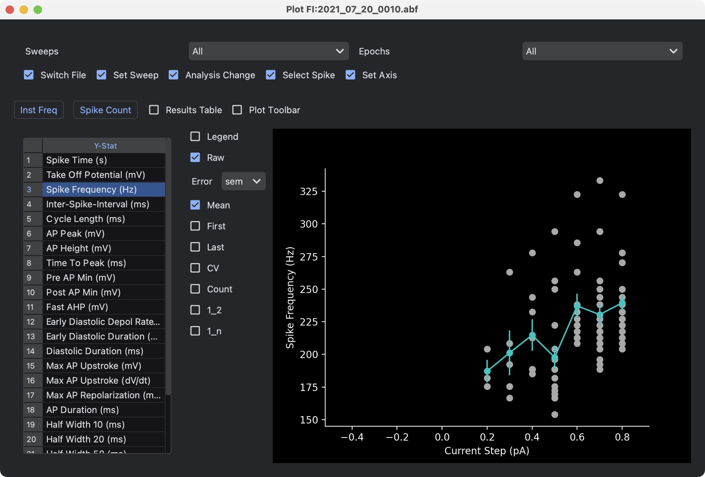
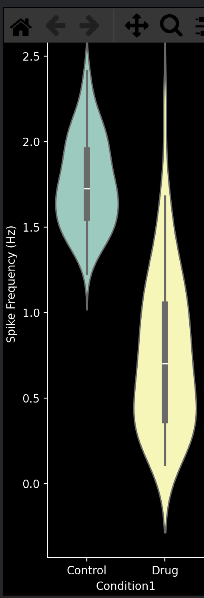
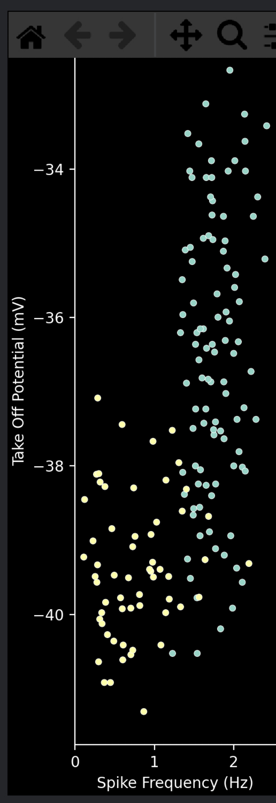
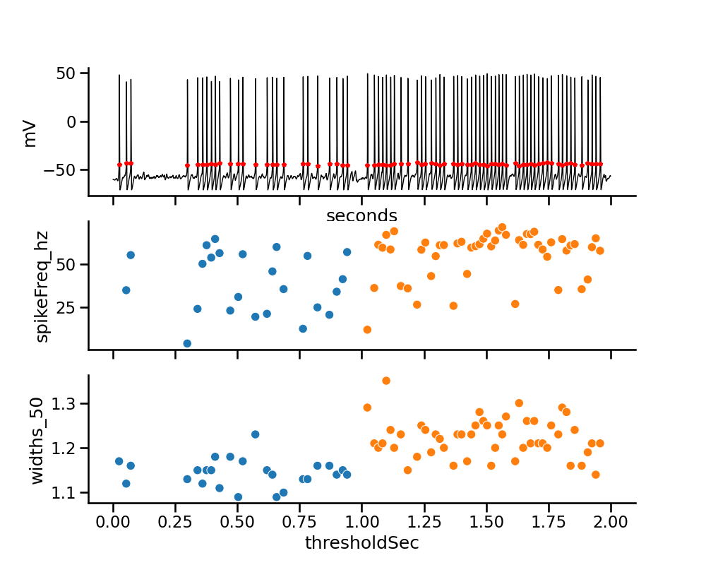
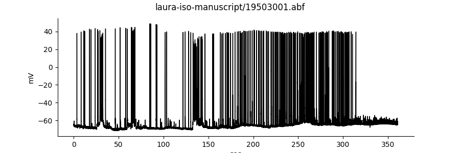

This folder contains Python code and raw data files to regenerate the figures from the manuscript.

To run these example scripts, first change into the `manuscript-figures` folder with

    cd manuscript-figures

### Figure 3. Plugins for input-output experiments

This is a recipe for remaking figure 3 from the GUI.

1) Run SanPy
2) Select menu `File -> Open ...`
3) Open data file `2021_07_20_0010.abf`
4) Move forward to a sweep with a number of spikes (e.g. sweep 14)
5) Select `Fast Neuron` in the `Detection - Presets` popup
6) Display the derivative of the recording with the `View - Derivative` menu
7) In the derivative plot, click and drag the horizontal cursor (C) to set the desired dvdt threshold for spike detection
8) Right click the cursor and select the  `Set dvdt Threshold` menu
9) Click the `Detect dV/dt` button in the `Detection` panel.

Finally, run the plugins to genarate Figure 3 a/b

10) Select the `Plugins - Plot Recording` menu, this will generate panel (a)
11) Select the `Plugins - Plot FI` menu, this will generate panel (b)

Screen shot of the main GUI.


Right click the dvdt plot and select `Set dvdt Threshold`.


Figure 3a, the `Plot Recording` plugin.


Figure 3b, the `Plot FI` plugin.


### Figure 4. Pooling plugin 

This is a recipe for reproducing the plots in Figure 4. This will not be the same exact data but the plots will be similar

1) Run SanPy
2) Use `Load Folder ...` to load the provided sample data in the `data/` folder.
3) Load and analyze two raw data files. Try with `19114001.abf` and `20191009_0005.abf`
4) Use the `Set Meta Data` plugin to set the `Condition1` of one file to `Control`, and the other file to `Drug`
3) Run the `Plot Tool (pool)` plugin
4) Set the interface as follows
    - Plot Type: Violin Plot
    - Hue: Condition1
    - X-Stat: Condition1
    - Y-Stat: Spike Frequency (Hz)

The plot in the plugin should look something like this


The step above can be repeated for any `Y-Stat` such as `Take Off Potential (mV)` or other.

A scatter plot is easily created by selecting Plot Type `Scatter Plot` and choosing the desired X-Stat and Y-Stat.



### Figure 5. Programming with the API.

`figure_5_api.py` will generate the following



### Figure 6. Example analysis of current-clamp recording from a cardiac myocyte. 

`figure_6_myocyte_analysis.py` will generate the following


Please note, the statistical significance is not on the plot but can be manually added in other plotting software. Instead, the statistics are printed to the terminal as:

```
spikeFreq_hz: Control vs Iso MannwhitneyuResult(statistic=788.0, pvalue=0.0005393353393200615)
  Control mean:0.776  std:0.719 n:30
   Iso    mean:1.167  std:0.556 n:91
widths_50: Control vs Iso MannwhitneyuResult(statistic=2.0, pvalue=2.8370742815640874e-16)
  Control mean:6.998  std:0.503 n:30
   Iso    mean:10.152  std:0.832 n:91
earlyDiastolicDurationRate: Control vs Iso MannwhitneyuResult(statistic=1103.0, pvalue=0.11649802918096606)
  Control mean:42.249  std:45.442 n:30
   Iso    mean:52.786  std:38.257 n:91
```

## Extras

`figure_extra_1.py` will generate the following plots



`figure_extra_2_timing.py` will generate spike detection time benchmarks.

Contact the authors to get the raw data.
