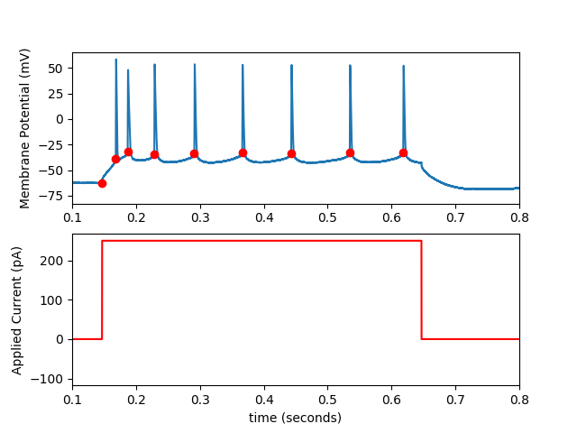

## Whole cell recording analysis

## Detect action potentials

See 'ap.ipynb'

```
abf = bLoadFile('data/171116sh_0018.abf')
sweepNumber = 15
spikeTimes = bSpikeDetect(abf, sweepNumber, dVthresholdPos=15)
bPlotSweep(abf, sweepNumber, spikeTimes=spikeTimes)
```



## Analyze action potentials

Coming soon, will plot current versus a number of AP parameters including: number, instantaneous frequency, spike threshold, ...

## Passive properties

Coming soon, will analyze and plot resting membrane potential, whole cell capacitance.

## Install

Requires

 - Python >= 3.7
 - numpy
 - matplotlib
 - plotly
 - pyabf - download from https://github.com/swharden/pyABF


## Change log

20190216, created the code and implemented ap detection