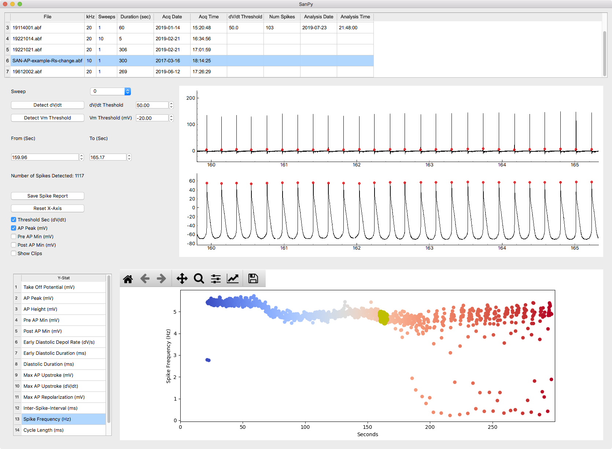
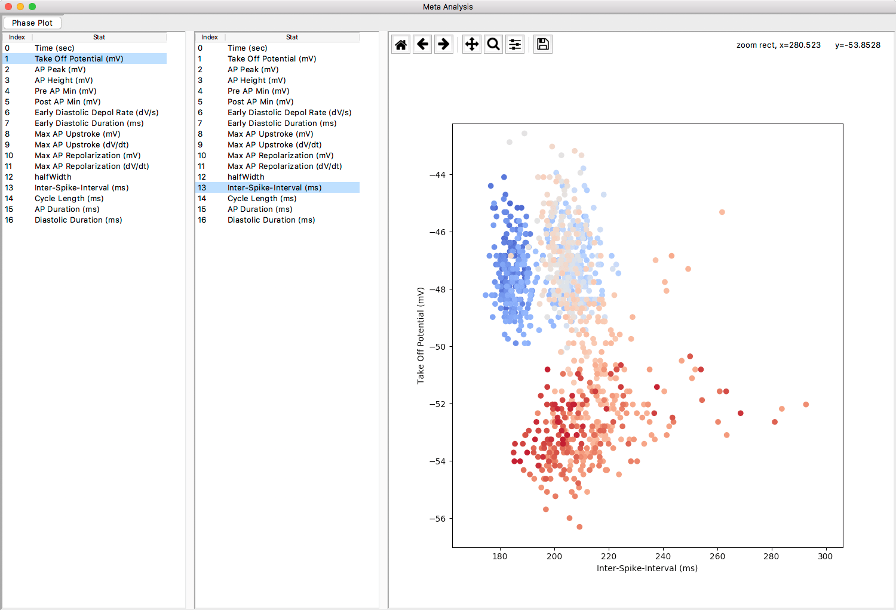

[](https://travis-ci.org/cudmore/SanPy)
[](https://github.com/cudmore/SanPy/actions/workflows/python-package.yml)

## SanPy, pronounced ['senpai']['senpai']

['senpai']: https://en.wikipedia.org/wiki/Senpai_and_k%C5%8Dhai

## Whole cell action potential analysis

Originally designed for cardiac myocytes, we have been busy extending this software to handle most whole-cell current clamp recordings and analysis.

We began with code to perform [cardiac action potential][cardiac action potential] analysis. Originally, this was primarily designed to analyze spontaneous cardiac action potentials from whole-cell current-clamp recordings of [cardiac myocytes].

[cardiac action potential]: https://en.wikipedia.org/wiki/Cardiac_action_potential
[cardiac myocytes]: https://en.wikipedia.org/wiki/Cardiac_muscle_cell

## Please see our documentation website

[https://cudmore.github.io/SanPy/](https://cudmore.github.io/SanPy/)

['sanpy-docs']: https://cudmore.github.io/SanPy/

## This is a work in progress, use with caution.

If you find the code in this repository interesting, please email Robert Cudmore at UC Davis (rhcudmore@ucdavis.edu) and we can get you started. We are looking for users and collaborators.

## Install from source

This code will run on macOS, Microsoft Windows, and Linux.

1) Clone the repository

```
git clone git@github.com:cudmore/SanPy.git
cd SanPy
```

2) Make a virtual environment (with either conda or venv)

2.1) With conda

```
conda create -y -n sanpy1-env python=3.9
conda activate sanpy1-env
```

2.2) With venv

```
python -m venv sanpy1-env
source sanpy1-env/bin/activate
```

3) Install the code

```
pip install -e .
```

4) Run `sanpy`

```
sanpy
```

## Desktop Application

The desktop application allows the user to load a folder of files (top table). Selecting a file will display both the derivative and raw membrane potential (middle two traces). Spike detection is then easily performed by specifying a threshold in either the derivative of the membrane potential or the membrane potential itself. Once spikes are detected, the detection parameters are overlaid over the raw membrane and derivative traces. Finally, there is an interface (lower table and colored plot) to inspect the detection parameters.






## Writing custom Python scripts

In just a few lines of code, recordings can be loaded, analyzed, and plotted. See the [/examples](examples) folder for examples.

```
import matplotlib.pyplot as plt
import bAnalysis
import bAnalysisPlot

ba = bAnalysis.bAnalysis('data/SAN-AP-example-Rs-change.abf')
ba.spikeDetect()

bAnalysisPlot.bPlot.plotSpikes(ba, xMin=140, xMax=145)
plt.show()
```


## What spike parameters are detected?

We are following the cardiac myocyte nomenclature from this paper:

[Larson, et al (2013) Depressed pacemaker activity of sinoatrial node
myocytes contributes to the age-dependent decline in maximum heart rate. PNAS 110(44):18011-18016][larson et al 2013]

- MDP and Vmax were defined as the most negative and positive membrane potentials, respectively
- Take-off potential (TOP) was defined as the membrane potential when the first derivative of voltage with respect to time (dV/dt) reached 10% of its maximum value
- Cycle length was defined as the interval between MDPs in successive APs
- The maximum rates of the AP upstroke and repolarization were taken as the maximum and minimum values of the first derivative (dV/dtmax and dV/dtmin, respectively)
- Action potential duration (APD) was defined as the interval between the TOP and the subsequent MDP
- APD_50 and APD_90 were defined as the interval between the TOP and 50% and 90% repolarization, respectively
- The diastolic duration was defined as the interval between MDP and TOP
- The early diastolic depolarization rate was estimated as the slope of a linear fit between 10% and 50% of the diastolic duration and the early diastolic duration was the corresponding time interval
- The nonlinear late diastolic depolarization phase was estimated as the duration between 1% and 10% dV/dt

[larson et al 2013]: https://www.ncbi.nlm.nih.gov/pubmed/24128759

## Why is this useful?

We provide a Python library that can load, analyze, save, and plot eletropysiology recordings. This library is then accessed through simple to use graphical user interfaces (GUIs) with either a traditional desktop or web based application. Finally, the same code that drives the user interface can be scripted. In just a few lines of code, the exact same loading, analysis, saving, and plotting can be performed as is done with the GUIs.

## Why is this important?

When you publish a paper, you need to ensure your primary data is available for interogation and that your analysis can be reproduced. This software facilitates that by allowing you to share the raw data, provide the code that was used to analyze it, and explicity show how it was analyzed such that it can be verified and reproduced.

## Other software

These is of course other software to do similar things. This is not a complete list.

 - [ParamAP][ParamAP] - Standardized parameterization of sinoatrial node myocyte action potentials
 - [stimfit][stimfit] - A program for viewing and analyzing electrophysiological data

C++ libraries

 - [biosig][biosig] - A C/C++ library providing reading and writing routines for biosignal data formats
 - [sigviewer][sigviewer] - SigViewer is a viewing application for biosignals.

[ParamAP]: https://github.com/christianrickert/ParamAP
[stimfit]: https://github.com/neurodroid/stimfit
[biosig]: http://biosig.sourceforge.net/projects.html
[sigviewer]: https://github.com/cbrnr/sigviewer