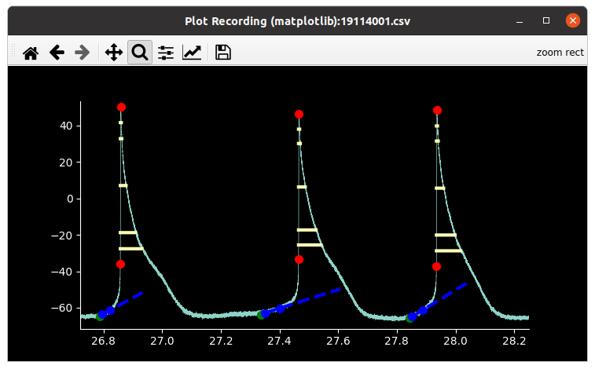
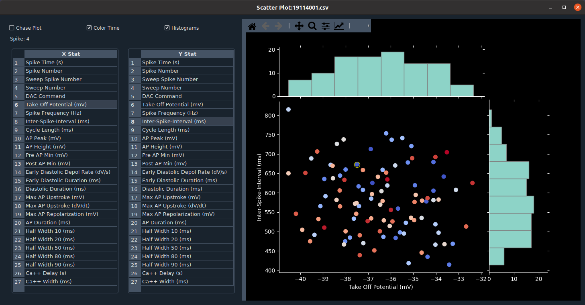

## SanPy is software for whole-cell current clamp analysis

SanPy is designed to analyze action potentials and extract a number of parameters including spike time, voltage threshold, half-widths, interval statistics, and lots more.

SanPy is optimized for a wide range of whole-cell current-clamp recordings including cardiac myocytes and neurons.

Please see the [SanPy documentation](https://cudmore.github.io/SanPy/).

### SanPy preprint on bioRxiv

Guarina L, Johnson TL, Griffith T, Santana LF, Cudmore RH (2023) SanPy: A whole-cell electrophysiology analysis pipeline. bioRxiv 2023.05.06.539660; doi: [https://doi.org/10.1101/2023.05.06.539660](https://doi.org/10.1101/2023.05.06.539660)]

### Desktop Application

We provide desktop applications for macOS and Windows users. Go to the [download page](https://cudmore.github.io/SanPy/download/) to get started. No command line, no complicated installation, just an easy to use point and click GUI!

**Footnote:** We are waiting to get a Microsoft software certificate so we can ship the Windows exe version. Please check back in a bit. In the meantime, the SanPy desktop application can always be [installed from source](https://cudmore.github.io/SanPy/install/)

### Plugins
 
The desktop application comes bundled with a growing number of plugins. See our [plugin documentation page](https://cudmore.github.io/SanPy/plugins/).

<table style="border=1px">
<tr>
    <td>
    
    </td>
    <td>
    
    </td>
</tr>
<tr>
    <td>
    
    </td>
    <td>
    
    </td>
</tr>
</table>

### Contributing to SanPy

To install SanPy from source, see our [install instructions](https://cudmore.github.io/SanPy/install/).

To make SanPy extensible, users can create their own file loaders, analysis, and plugins. Please see our [API documentation](https://cudmore.github.io/SanPy/api/overview) with lots of examples to get started.

### Contact

If you find the code in this repository interesting, please email Robert Cudmore at UC Davis (rhcudmore@ucdavis.edu) and we can get you started. We are looking for users and collaborators.