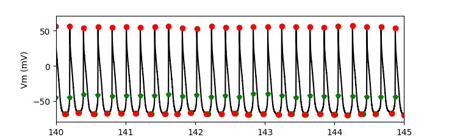

## Whole cell myocyte action potential analysis

This repository has code to perform action potential analysis. It is primarily designed to analyze spontaneous action potentials from cardiac myocytes.

## Install

#### 1) We assume you have the following

 - [Python 3.7.x][python3]
 - [pip][pip]
 - [git][git]
 - [virtualenv][virtualenv].

#### 2) Run the following commands in a terminal window

```
# clone the github repository (this will create a bAnalysis folder)
git clone https://github.com/cudmore/bAnalysis.git

# change into the cloned bAnalysis folder
cd bAnalysis

# create a Python3 virtual environment in 'bAnalysis_env'
mkdir bAnalysis_env
virtualenv -p python3 --no-site-packages bAnalysis_env

# activate the virtual environment in bAnalysis_env
source bAnalysis_env/bin/activate

# install the required python packages (into the activated virtual environment)
pip install -r requirements.txt
```

## Running the graphical-user-interface

```
# activate the virtual environment in bAnalysis_env
source bAnalysis_env/bin/activate

# run the graphical-user-interface
python bAnalysisApp/AnalysisApp.py
```

Once the interface is up, select a folder with .abf files using the main 'File - Open Folder...' menu.

Once you load a folder and select a file, it should look something like this.


## Writing your own Python scripts

See `bBrowser.ipynb`

```
abf = bLoadFile('data/171116sh_0018.abf')
sweepNumber = 15
spikeTimes = bSpikeDetect(abf, sweepNumber, dVthresholdPos=15)
bPlotSweep(abf, sweepNumber, spikeTimes=spikeTimes)
```



## What are all these numbers?

We are following the cardiac myocyte nomenclature from this paper:

[Larson, et al (2013) Depressed pacemaker activity of sinoatrial node
myocytes contributes to the age-dependent decline in maximum heart rate. PNAS 110(44):18011-18016][larson et al 2013]

- MDP and Vmax were defined as the most negative and positive membrane potentials, respectively
- Take-off potential (TOP) was defined as the membrane potential when the first derivative of voltage with respect to time (dV/dt) reached 10% of its maximum value
- Cycle length was defined as the interval between MDPs in successive APs
- The maximum rates of the AP upstroke and repolarization were taken as the maximum and minimum values of the first derivative (dV/dtmax and dV/dtmin, respectively)
- Action potential duration (APD) was defined as the interval between the TOP and the subsequent MDP
- APD_50 and APD_90 were defined as the interval between the TOP and 50% and 90% repolarization, respectively
- The diastolic duration was defined as the interval between MDP and TOP
- The early diastolic depolarization rate was estimated as the slope of a linear fit between 10% and 50% of the diastolic duration and the early diastolic duration was the corresponding time interval
- The nonlinear late diastolic depolarization phase was estimated as the duration between 1% and 10% dV/dt

### What is a good recording

- Access resistance (Ra) should be less than 10 MOhm and not changing during the recording


[larson et al 2013]: https://www.ncbi.nlm.nih.gov/pubmed/24128759

## Troubleshooting

Type each of the following into a Terminal window. If you see 'command not found' then you need to install the component.

You need Python 3.7.0 or newer

```
python --version
```

You need pip

```
pip --version
```

You need git

```
git --version
```

You need virtualenv

```
virtualenv --version
```

## Change log

20190216, created the code and implemented ap detection

## To Do

### 20190326

 - Save analysis csv file and reload when loading folder. Don't always require re-analysis. Will break when format of csv file changes, make sure to include a file version.
 - Implement all stats used by Larson ... Proenza (2013) paper.
 - Show average spike clip in red
 - Export average spike clip
 - Take all stats on average spike clip. Is it different from taking average across all spikes?

## Advanced

#### Building a stand alone app (macOS)

Install pyinstaller

    pip install pyinstaller

Make the app

    cd bAnalysisApp
    ./makeapp

You can find the app in `dist/SpikeAnalysis.app`.

#### Download the AnalysisApp (This link will normally be broken)

    https://www.dropbox.com/l/scl/AAA2ECakLelv0xuo3YE74lFiH-9hdROEwkw


[python3]: https://www.python.org/downloads/
[pip]: https://pip.pypa.io/en/stable/
[pyabf]: https://github.com/swharden/pyABF
[paramap]: https://github.com/christianrickert/ParamAP
[git]: https://git-scm.com/book/en/v2/Getting-Started-Installing-Git
[virtualenv]: https://virtualenv.pypa.io/en/stable/
