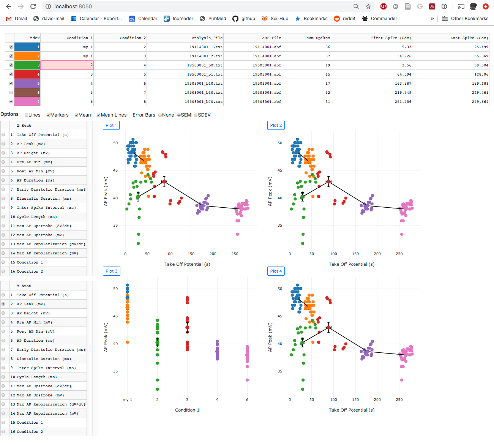

## This is a work in progress, do not use this code. 

If you find the code in this repository interesting, please email Robert Cudmore at UC Davis (rhcudmore@ucdavis.edu) and we can get you started. We are looking for users and collaborators.

## Whole cell myocyte action potential analysis

This repository has code to perform [cardiac action potential][cardiac action potential] analysis. It is primarily designed to analyze spontaneous cardiac action potentials from whole-cell recordings of [cardiac myocytes].

[cardiac action potential]: https://en.wikipedia.org/wiki/Cardiac_action_potential
[cardiac myocytes]: https://en.wikipedia.org/wiki/Cardiac_muscle_cell

## Desktop Application

Once the interface is up, select a folder with .abf files using the main 'File - Open Folder...' menu.

Once a folder is loaded and a file is selected, the interface should look something like this.


Selecting menu 'Meta Window' allows detected parameters to be plotted versus each other to explore correlations.


## Web Application

The browser based web application provides the same interface for analysis as the desktop application.


Once data is analyzed, Pooling allows browsing detection parameters across any number of files.





## Writing custom Python scripts

See the [/examples](examples) folder.

```
from bAnalysis import bAnalysis
ba = bAnalysis.bAnalysis('data/19114001.abf')
ba.spikeDetect(dVthresholdPos=100, medianFilter=3, halfHeights=[20,50,80])
ba.plotSpikes()
```


## Install

This code will run on either macOS or Microsoft Windows.

Assuming you have the following

 - [Python 3.7.x][python3]
 - [pip][pip]
 - [git][git] (optional)

### Install the desktop application

##### Option 1) Install using ./install

```
# If you have git install.
# Clone the github repository (this will create a bAnalysis folder).
git clone https://github.com/cudmore/bAnalysis.git

# If you do not have git installed you can download the .zip file manually.
# In a browser, go to 'https://github.com/cudmore/bAnalysis'.
# Click green button 'Clone or download'.
# Select 'Download ZIP'.
# Once downloaded, manually extract the contents of the .zip file and continue following this tutorial.

# Change into the cloned or downloaded 'bAnalysis' folder.
cd bAnalysis

# Install
./install

# Run
./run
```

##### Option 2) Install manually

```
# clone the github repository (this will create a bAnalysis folder)
git clone https://github.com/cudmore/bAnalysis.git

# change into the cloned bAnalysis folder
cd bAnalysis

# create a Python3 virtual environment in 'bAnalysis_env'
mkdir bAnalysis_env
virtualenv -p python3 --no-site-packages bAnalysis_env

# activate the virtual environment in bAnalysis_env
source bAnalysis_env/bin/activate

# install the required python packages (into the activated virtual environment)
pip install -r requirements.txt
```

### Running the desktop application

##### Option 1) Using ./run

```
./run
```

##### Option 2) Manually

```
# activate the virtual environment in bAnalysis_env
source bAnalysis_env/bin/activate

# run the desktop application
python bAnalysisApp/AnalysisApp.py
```

### Install the web application

```
cd bAnalysis/dash
pip install -r requirements.txt
```

### Running the web applications

Run the web application to analyze raw data

```
cd bAnalysis/dash
python3 app2.py
```

The web application for analysis is available at

```
http://localhost:8000
```

Run the web application to browse and pool saved analysis

```
cd bAnalysis/dash
python3 bBrowser_app.py
```

The web application for browsing and pooling saved analysis is available at

```
http://localhost:8050
```

## What spike parameters are detected?

We are following the cardiac myocyte nomenclature from this paper:

[Larson, et al (2013) Depressed pacemaker activity of sinoatrial node
myocytes contributes to the age-dependent decline in maximum heart rate. PNAS 110(44):18011-18016][larson et al 2013]

- MDP and Vmax were defined as the most negative and positive membrane potentials, respectively
- Take-off potential (TOP) was defined as the membrane potential when the first derivative of voltage with respect to time (dV/dt) reached 10% of its maximum value
- Cycle length was defined as the interval between MDPs in successive APs
- The maximum rates of the AP upstroke and repolarization were taken as the maximum and minimum values of the first derivative (dV/dtmax and dV/dtmin, respectively)
- Action potential duration (APD) was defined as the interval between the TOP and the subsequent MDP
- APD_50 and APD_90 were defined as the interval between the TOP and 50% and 90% repolarization, respectively
- The diastolic duration was defined as the interval between MDP and TOP
- The early diastolic depolarization rate was estimated as the slope of a linear fit between 10% and 50% of the diastolic duration and the early diastolic duration was the corresponding time interval
- The nonlinear late diastolic depolarization phase was estimated as the duration between 1% and 10% dV/dt

[larson et al 2013]: https://www.ncbi.nlm.nih.gov/pubmed/24128759

## Other software

[ParamAP][ParamAP] - Standardized parameterization of sinoatrial node myocyte action potentials

[ParamAP]: https://github.com/christianrickert/ParamAP


## Technologies used

#### Backend

 - [Python][Python]
 - [Pandas][Pandas]
 - [NumPy][NumPy]
 - [pyABF][pyABF] - Package to open Axon Binary Format (ABF) files

#### Desktop Application

 - [TkInter][TkInter] - Desktop applicaiton interface
 - [Matplotlib][Matplotlib] - Desktop application plotting

#### Web application

 - [Plotly Python][Plotly]
 - [Plotly Dash][Dash] - Web application interface
 - [Dash Bootstrap components][Dash Bootstrap components]

[Python]: https://www.python.org/
[Pandas]: https://pandas.pydata.org/
[NumPy]: https://www.numpy.org/
[pyABF]: https://github.com/swharden/pyABF
[TkInter]: https://docs.python.org/3/library/tkinter.html
[Matplotlib]: https://matplotlib.org/
[Plotly]: https://plot.ly/python/
[Dash]: https://plot.ly/products/dash/
[Dash Bootstrap components]: https://dash-bootstrap-components.opensource.faculty.ai/

## Troubleshooting

Type each of the following into a Terminal window. If you see 'command not found' then you need to install the component.

You need Python 3.7.0 or newer

```
python --version
```

You need pip

```
pip --version
```

You need git

```
git --version
```

## Change log

 - 20190216, Created the code and implemented ap detection
 - 20190518, Started making web application (fairly complete as of 20190601)

## To Do

### 20190326

 - Save analysis csv file and reload when loading folder. Don't always require re-analysis. Will break when format of csv file changes, make sure to include a file version.
 - Implement all stats used by Larson ... Proenza (2013) paper.
 - Show average spike clip in red
 - Export average spike clip
 - Take all stats on average spike clip. Is it different from taking average across all spikes?

### 20190329

Done:
 - 'Save Spike Report' now prompts for a file name
 - Added checkbox option to hide/show spike clips. It was getting too slow to always show spike clips when there are a ton of spikes. When you want to see them, you just turn it on.
 - Excel file column width are now (sanely) wider
 - Added max upstroke and min downstroke dV/dt to excel report
 - Added spike errors to excel report

To Do:
 - Convert ALL reported units to milli-seconds
 - Add new window to plot stats on x/y. For example, peak AP amplitude (mV) versus spike width (ms).

## Advanced

#### Building a stand alone app (macOS)

Install pyinstaller

    pip install pyinstaller

Make the app

    cd bAnalysisApp
    ./makeapp

You can find the app in `dist/SpikeAnalysis.app`.

#### Download the AnalysisApp

**This is not available yet** but we plan on distributing a precompiled application for both macOS and Microsoft Windows.

Be sure to download the .zip file by clicking the triple tilde '...' on the top-right of the page and select download.

Once you have the .zip file ...

When you run the app you will see a dialog telling you 'Can't be opened because it is from an unidentified developer'.

You need to go into your 'Apple Menu - System Preferences - Security & Privacy'

Find the part that says "SpikeAnalysis... was blocked from opening because it is not from an identified developer" and click "Open Anyway"

After that, you are good to go!

[python3]: https://www.python.org/downloads/
[pip]: https://pip.pypa.io/en/stable/
[pyabf]: https://github.com/swharden/pyABF
[paramap]: https://github.com/christianrickert/ParamAP
[git]: https://git-scm.com/book/en/v2/Getting-Started-Installing-Git
[virtualenv]: https://virtualenv.pypa.io/en/stable/
